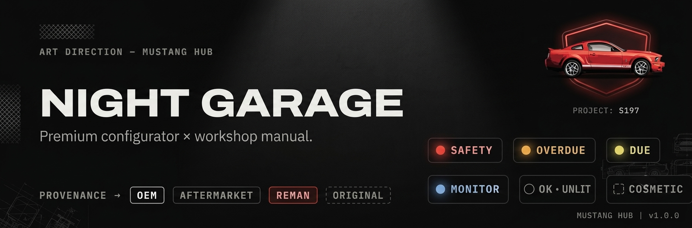

<p align="center">
  
</p>

<h1 align="center">Mustang Hub</h1>

<p align="center">
  Interactive parts &amp; maintenance hub for a 2008 Ford Mustang V6 — design direction <strong>“Night Garage.”</strong>
</p>

<p align="center">
  <a href="https://mustang-hub.vercel.app"></a>
  <a href="https://mustang-hub.vercel.app"></a>
  
  
  
  
</p>

---

## Run it

```bash
cp .env.example .env.local   # fill in values (or leave auth blank to run open)
npm install
npm run dev                  # http://localhost:3000
```

> The live site is password-gated. Locally, if `SITE_PASSWORD` / `AUTH_SECRET` are unset the login gate is disabled and the site runs open.

## What's here

- **Garage stage (hero)** — a cinematic near-black stage showing the car in three **reveal states**: `EXTERIOR · ENGINE BAY · UNDERSIDE`. The state switcher cross-fades between them; a **CINEMA / MECH** motion toggle changes the transition grammar. Status-colored **hotspots** sit on each state; tapping one **spotlights** it and slides in the part sheet.
  - **Exterior** and **Engine Bay** are real photos of the car; **Underside** is a schematic (photo pending). Each state is a swappable layer — hotspot `{ state, x, y }` coords live in `data/vehicle.ts`.
  - **Zoom & pan** on the photo states — scroll / trackpad-pinch zooms toward the cursor, drag to pan, double-click or `+ / − / ⤢` to control it. Hotspots track their features and stay a constant size while you zoom.
- **Part sheet** — status lamp + provenance chip, the shop finding, a spec/torque table (mono, display-size numbers), est cost + DIY time, and a full sheet with linked source docs.
- **Tabs** — `PARTS` (urgency-sorted), `TIMELINE` (CARFAX + shop history, title event as a break in the rail), `COSTS` (spent vs. upcoming, range bars), `DOCUMENTS` (thumbnails that open the real files + full salvage/NAM disclosure).
- **Salvage/NAM honesty** — riveted VIN plate in the header (gold), odometer `†` footnote, full disclosure card in Documents. Gold = title matters; red = physical danger. Never mixed.
- **Data** — `data/vehicle.ts` is the **canonical source of truth**. Edit it to update the site.

## Design system

- **Type** — Archivo (display, `font-stretch:125%`), IBM Plex Sans (body), IBM Plex Mono (data/numbers), via `next/font`.
- **Status = annunciator lamps** — SAFETY (pulses) · OVERDUE · DUE · MONITOR · DONE · OK (unlit) · COSMETIC (dashed). Defined in `lib/types.ts` (`ST`).
- **Provenance = typographic chips** — OEM · AFTERMARKET · REMAN (torch-tinted) · ORIGINAL. Status owns color; provenance never gets a colored dot.
- **Surfaces** — VOID / STAGE / PANEL / RAISED + torch red (≤2 uses/screen) + title-gold. Tokens in `app/globals.css`.

## Configuration

Environment variables (see `.env.example`):

| Variable | Purpose |
| --- | --- |
| `SITE_PASSWORD` | Single password for the `/login` gate. Unset ⇒ site is open. |
| `AUTH_SECRET` | Random secret stored in the session cookie. `openssl rand -hex 24`. |
| `NEXT_PUBLIC_VEHICLE_VIN` | VIN shown in the header (kept out of source). |
| `NEXT_PUBLIC_VEHICLE_PLATE` | Plate shown in the header eyebrow. |

**Privacy:** the owner's personal documents (CARFAX, service invoice, VIN/tire placards) are **git-ignored** and not in this public repo. A `.vercelignore` keeps them deployed so the live Documents tab still works. Cloning the repo will show placeholder gaps for those four files — everything else runs.

## Stack

Next.js 15 (App Router) · React 19 · Tailwind CSS v4 · TypeScript · `next/font`. Deploys on Vercel.

## Roadmap

- **Now** — undercarriage photo to replace the last schematic state.
- **Next** — deep-link a part from the list straight into the garage; per-part source-doc mapping in the full sheet.
- **Stretch** — rotatable 3D exterior scan (react-three-fiber) as the exterior state.

## Notes

The car is **salvage / not-actual-mileage titled** — surfaced honestly throughout. Keep it that way.
